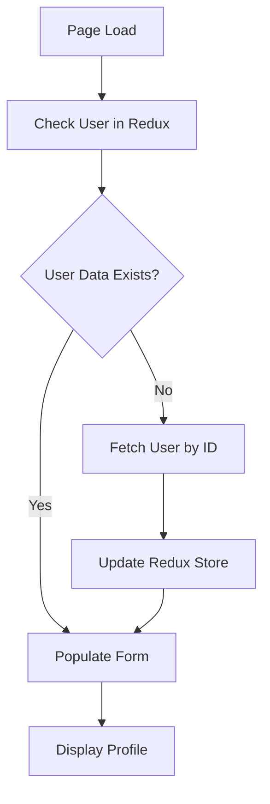
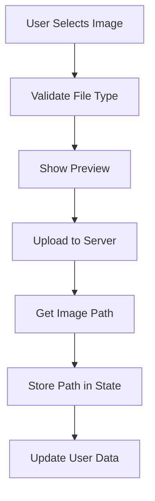
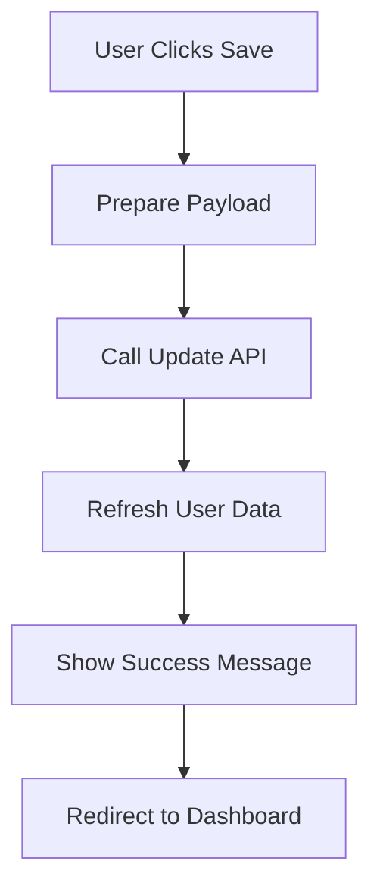

# Profile Page Implementation Documentation

## Table of Contents
1. [Overview](#overview)
2. [Architecture](#architecture)
3. [Data Flow](#data-flow)
4. [Component Structure](#component-structure)
5. [Image Upload Workflow](#image-upload-workflow)
6. [Profile Update Process](#profile-update-process)
7. [State Management](#state-management)
8. [API Integration](#api-integration)
9. [UI Components](#ui-components)
10. [Error Handling](#error-handling)

---

## Overview

The profile page allows users to view and update their personal information, including profile image upload. It's a protected route that requires authentication and uses Redux for state management.

### Key Features
- **Profile Information Display**: Shows user details like name, email, role, organization
- **Image Upload**: Allows users to upload and preview profile pictures
- **Form Validation**: Validates user inputs before submission
- **Real-time Preview**: Shows image preview immediately after selection
- **Responsive Design**: Works on desktop and mobile devices

---

## Architecture

### File Structure
```
src/
├── app/(protected)/profile/
│   └── page.tsx                    # Main profile page component
├── components/ui/
│   ├── AvatarFallback.tsx         # Avatar component with initials
│   └── Button.tsx                 # Custom button component
├── services/
│   └── profileApiService.ts       # Profile-related API calls
├── store/
│   ├── userSlice.ts              # User state management
│   └── userthunk.ts              # Async user actions
└── lib/
    └── createApiClient.ts        # API client configuration
```

---

## Data Flow

### 1. Profile Loading Flow


### 2. Image Upload Flow


### 3. Profile Update Flow


---

## Component Structure

### Main Profile Component (`page.tsx`)

```typescript
const PersonalCard = () => {
  // State Management
  const [formData, setFormData] = useState({
    fullName: "",
    userName: "",
    email: "",
    role: "",
    organization: "",
    country: "",
    user_profile_img_path: ""
  });
  
  const [uploadedImagePath, setUploadedImagePath] = useState<string>("");
  const [selectedImage, setSelectedImage] = useState<string | null>(null);
  
  // Redux Integration
  const userDetail = useAppSelector((state: RootState) => state.user?.userDetail);
  const dispatch = useAppDispatch();
  
  // File Upload Reference
  const fileInputRef = useRef<HTMLInputElement>(null);
```

### Key State Variables

| Variable | Type | Purpose |
|----------|------|---------|
| `formData` | Object | Stores all form field values |
| `uploadedImagePath` | String | Stores server-returned image path |
| `selectedImage` | String/null | Stores preview image (base64 or URL) |
| `userDetail` | Object | User data from Redux store |
| `fileInputRef` | Ref | Reference to hidden file input |

---

## Image Upload Workflow

### Step 1: File Selection
```typescript
const handleFileChange = async (e: React.ChangeEvent<HTMLInputElement>) => {
  const file = e.target.files?.[0];
  
  // Validate file type
  if (!file || !file.type?.startsWith('image/')) {
    toast.error("Please select an image file (jpg/png).");
    return;
  }
  
  // Show immediate preview
  const reader = new FileReader();
  reader.onloadend = () => setSelectedImage(reader.result as string);
  reader.readAsDataURL(file);
```

### Step 2: Upload to Server
```typescript
  // Prepare FormData for upload
  const formData = new FormData();
  formData.append("file", file);

  try {
    const response = await profileImageUpload(formData);
    const path = response.data.image_path;
    setUploadedImagePath(path);
    toast.success("Image uploaded successfully!");
    
    // Refresh user data
    if (userId) await dispatch(fetchUserById(userId));
  } catch (err) {
    console.error("Image upload failed:", err);
    toast.error("Failed to upload image.");
  }
};
```

### Step 3: Image Display Logic
```typescript
// Display logic in component
{selectedImage ? (
  
) : (
  <AvatarFallback
    name={formData.fullName}
    className="w-20 h-20 rounded-full border border-gray-300 shadow-md text-xl"
  />
)}
```

### Image Processing Details

#### Supported Formats
- **JPEG** (.jpg, .jpeg)
- **PNG** (.png)

#### Image Handling
1. **Client-side Preview**: Uses FileReader to create base64 preview
2. **Server Upload**: Sends FormData with multipart/form-data
3. **Storage**: Server returns image path for database storage
4. **Display**: Converts base64 or path to displayable format

#### Base64 Processing
```typescript
// Handle base64 images from server
if (userDetail.user_profile_img_path && !selectedImage) {
  const raw = userDetail.user_profile_img_path.trim();
  const isDataURL = raw?.startsWith("data:image");
  
  const imageUrl = isDataURL ? raw : `data:image/jpeg;base64,${raw}`;
  setSelectedImage(imageUrl);
}
```

---

## Profile Update Process

### Step 1: Form Data Preparation
```typescript
const handleSave = async () => {
  const payload = {
    id: userId,
    full_name: formData.fullName,
    user_name: formData.userName,
    country: formData.country,
    user_profile_img_path: uploadedImagePath  // Include uploaded image path
  };
```

### Step 2: API Call and State Update
```typescript
  try {
    await updateProfile(payload);
    if (userId) await dispatch(fetchUserById(userId));
    toast.success("Profile updated successfully!");
    router.push("/dashboard");
  } catch (error) {
    console.error('Error updating profile:', error);
    toast.error("Failed to update profile. Please try again.");
  }
};
```

### Field Configuration
```typescript
const fields = [
  { label: "Full Name", name: "fullName", disabled: false },
  { label: "User Name", name: "userName", disabled: false },
  { label: "Email", name: "email", disabled: true },           // Read-only
  { label: "Role", name: "role", disabled: true },             // Read-only
  { label: "Organization Name", name: "organization", disabled: true }, // Read-only
  { label: "Country", name: "country", disabled: false },
];
```

---

## State Management

### Redux Integration

#### User Slice Structure
```typescript
interface UserDetail {
  full_name?: string;
  user_name?: string;
  email?: string;
  role?: { name?: string; };
  organization?: { name?: string; id?: string; };
  country?: string;
  isAuthenticated?: boolean;
  user_profile_img_path?: string;
}

interface UserState {
  userDetail: UserDetail;
}
```

#### Actions Used
- `fetchUserById(userId)`: Fetches user data from API
- `userResponse(userData)`: Updates user data in store
- `clearUserState()`: Clears user data on logout

#### Data Persistence
```typescript
// Redux persist configuration
const persistConfig = {
  key: "root",
  storage,
  whitelist: ["user", "accessRights"], // Persist user data
};
```

---

## API Integration

### Profile API Service (`profileApiService.ts`)

#### Base Configuration
```typescript
const PROFILE_BASE_URL = process.env.NEXT_PUBLIC_PROFILE_API_BASE_URL;
const profileApi = createApiClient(PROFILE_BASE_URL);
```

#### API Endpoints

| Function | Method | Endpoint | Purpose |
|----------|--------|----------|---------|
| `Getrole(userId)` | GET | `/${userId}` | Fetch user profile |
| `updateProfile(payload)` | PUT | `/` | Update profile data |
| `profileImageUpload(formData)` | POST | `/image` | Upload profile image |

#### Image Upload Implementation
```typescript
export const profileImageUpload = async (payload: FormData) => {
  return await profileApi.post("/image", payload, {
    headers: {
      'Content-Type': 'multipart/form-data',
    },
  });
};
```

### API Response Format

#### User Profile Response
```json
{
  "data": {
    "full_name": "John Doe",
    "user_name": "johndoe",
    "email": "john@example.com",
    "role": { "name": "Admin" },
    "organization": { "name": "Company", "id": "123" },
    "country": "Singapore",
    "user_profile_img_path": "base64_string_or_path"
  }
}
```

#### Image Upload Response
```json
{
  "data": {
    "image_path": "/uploads/profile/user123_image.jpg",
    "message": "Image uploaded successfully"
  }
}
```

---

## UI Components

### AvatarFallback Component
```typescript
interface AvatarFallbackProps {
  name?: string;
  className?: string;
}

const AvatarFallback: React.FC<AvatarFallbackProps> = ({ name = "", className }) => {
  const initials = name
    .split(" ")
    .slice(0, 2)
    .map((word) => word.charAt(0))
    .join("")
    .toUpperCase();

  return (
    <Box className={`flex items-center justify-center bg-orange-500 text-white font-bold rounded border border-orange-500 ${className}`}>
      {initials || "U"}
    </Box>
  );
};
```

### Custom Button Component
- Reusable button with loading states
- Consistent styling across the application
- Supports click handlers and loading indicators

### Form Layout
- **Responsive Grid**: 1 column on mobile, 2 columns on desktop
- **Field Types**: Text inputs with validation
- **Disabled Fields**: Email, role, and organization are read-only
- **Styling**: Consistent with application theme

---

## Error Handling

### Client-side Validation
```typescript
// File type validation
if (!file || !file.type?.startsWith('image/')) {
  toast.error("Please select an image file (jpg/png).");
  return;
}
```

### API Error Handling
```typescript
try {
  await updateProfile(payload);
  toast.success("Profile updated successfully!");
} catch (error) {
  console.error('Error updating profile:', error);
  toast.error("Failed to update profile. Please try again.");
}
```

### Loading States
- **Profile Loading**: Shows loading message while fetching user data
- **Image Upload**: Displays loading indicator during upload
- **Form Submission**: Button shows loading state during save

### Toast Notifications
- **Success Messages**: Profile updated, image uploaded
- **Error Messages**: Upload failed, update failed, invalid file type
- **Validation Messages**: File type errors, missing data

---

## Security Considerations

### Authentication
- Protected route requiring valid JWT token
- User ID retrieved from secure cookies
- API calls include authentication headers

### File Upload Security
- Client-side file type validation
- Server-side validation (assumed)
- Secure file storage on server

### Data Validation
- Input sanitization on client and server
- Read-only fields for sensitive data (email, role)
- CSRF protection through API client

This documentation provides a complete understanding of how the profile page works, including image upload functionality and profile updates, making it easy to maintain, extend, or replicate in other projects.
